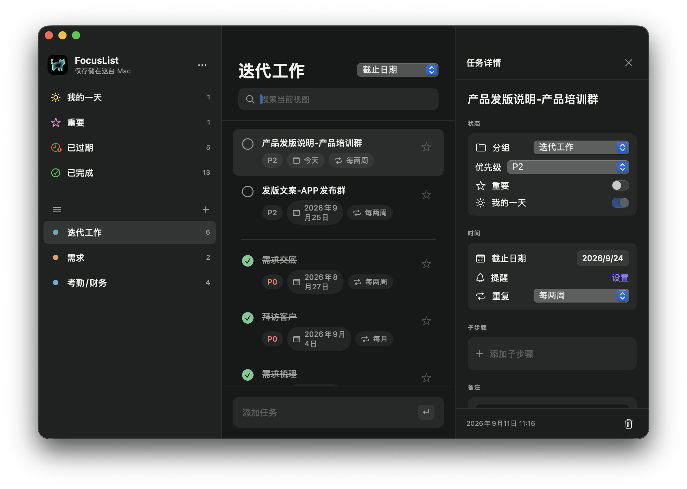

# FocusList

纯本地 macOS 任务管理应用，采用 SwiftUI / AppKit 构建，无账号、无网络请求、无第三方依赖。

[](https://github.com/Iman-GGG/FocusList/actions/workflows/build.yml)
[](LICENSE)

## 界面预览



## 构建与运行

### 环境要求

- macOS 14 或更高版本
- 支持 Swift 6 的 Xcode Command Line Tools

### 从源码构建

```bash
git clone https://github.com/Iman-GGG/FocusList.git
cd FocusList
./build-app.sh
open dist/FocusList.app
```

首次使用提醒功能时，系统会询问通知权限。

## 已实现

- 我的⼀天、智能建议、重要 / 已完成 / 已过期智能列表
- 自定义列表与分组、列表颜色、置顶 / 隐藏 / 删除 / 清理完成项
- 任务增删改查、分组切换、P0 / P1 / P2 优先级、截止日期、系统本地提醒、星标、备注、子步骤
- 25MB 本地附件、重复任务（日 / 周 / 每两周 / 月）
- JSON 导入与导出、本机 Application Support 持久化
- 深色三栏原生 macOS 界面

## 隐私与数据

- 所有任务和设置仅保存在本机 Application Support 目录。
- 应用不要求登录，不上传任务、附件或使用数据。
- 本地附件仅记录文件引用，单文件上限为 25MB。

## 参与贡献

欢迎提交 Bug、功能建议和 Pull Request。开始之前请阅读 [CONTRIBUTING.md](CONTRIBUTING.md)。安全问题请按照 [SECURITY.md](SECURITY.md) 私密报告。

## 许可证

本项目采用 [MIT License](LICENSE) 开源。

## 项目状态

桌面小组件需要完整 Xcode 的 Widget Extension 与签名配置，当前命令行构建版本未包含。
